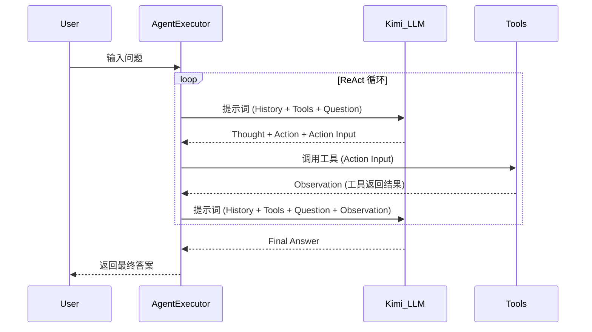

## Context

当前系统硬编码使用 OpenAI 的 `gpt-4o` 模型，且 API 密钥通过 `.env` 文件中的 `OPENAI_API_KEY` 加载。用户希望切换到 Kimi 模型，并改用从命令行参数指定的 `config/.config` 文件加载 API 密钥。

## Goals / Non-Goals

**Goals:**
- 将系统 LLM 从 OpenAI 切换为 Kimi (Moonshot AI)。
- 实现从 `config/.config` 文件加载 API 密钥的功能。
- 确保系统在切换模型后 ReAct 推理链依然稳定。

**Non-Goals:**
- 同时支持多种 LLM 模型（目前仅需切换到 Kimi）。
- 更改系统现有的分层架构。

## Decisions

### 1. 模型集成方式
- **决策**: 使用 `langchain-openai` 的 `ChatOpenAI` 类，但通过修改 `base_url` 指向 Kimi 的 API 接口 (`https://api.moonshot.cn/v1`)。
- **理由**: Kimi 的 API 与 OpenAI 兼容，这样可以减少代码改动量，且不需要引入额外的 `langchain-moonshot` 依赖。
- **备选方案**: 使用 `langchain-moonshot`。虽然更原生，但目前 `langchain-openai` 已经足够成熟且兼容性良好。

### 2. 配置文件解析
- **决策**: 实现一个简单的配置加载函数，读取 `config/.config` 文件。该文件采用简单的 `KEY=VALUE` 格式。
- **理由**: 与 `.env` 格式一致，解析简单，且符合用户“从特定文件读取”的要求。
- **解析逻辑**:
  ```python
  def load_config(path="config/.config"):
      config = {}
      with open(path, "r") as f:
          for line in f:
              if "=" in line:
                  k, v = line.strip().split("=", 1)
                  config[k] = v
      return config
  ```

### 3. 模型参数配置
- **决策**: 使用 `moonshot-v1-8k` 或 `moonshot-v1-32k` 模型。
- **理由**: Kimi 的主流模型。

## ReAct 循环序列图 (与原系统一致，仅 LLM 变更)



## Risks / Trade-offs

- **[Risk] Kimi 解析能力差异** → **Mitigation**: 调整 `react_prompt.py` 中的提示词，确保 Kimi 能准确输出 Thought/Action/Observation 格式。
- **[Risk] 配置文件路径不存在** → **Mitigation**: 在程序启动时检查 `config/.config` 是否存在，不存在则报错并提示用户创建。
- **[Risk] Token 限制** → **Mitigation**: Kimi 的上下文长度有多种版本，选择合适的版本并监控消耗。
