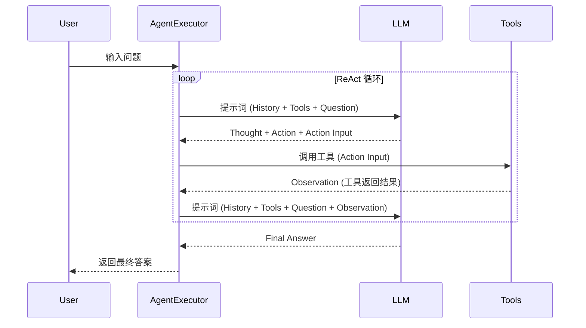

## Context

当前项目需要从零开始搭建一个基于 LangChain 的 ReAct 智能体系统。核心目标是实现一个模块化的分层架构，使智能体能够通过“思考-行动-观察”的循环自主调用外部工具（如搜索和维基百科）来回答复杂问题。

## Goals / Non-Goals

**Goals:**
- 实现清晰的目录分层：`tools/`, `prompt/`, `agent/`, `tests/`。
- 封装 LangChain 的 ReAct 智能体构建和执行逻辑。
- 提供基础的 Web 搜索和 Wikipedia 检索工具。
- 建立完整的自动化测试框架。
- 支持中文提示词和流式输出。

**Non-Goals:**
- 实现复杂的长期记忆管理（当前仅关注单次会话推理）。
- 集成过多的外部工具（初始阶段仅提供搜索和维基百科）。
- 前端界面开发（初始阶段仅支持命令行交互）。

## Decisions

### 1. 架构模式：分层模块化
- **决策**: 采用 `tools/prompt/agent/tests` 的分层结构。
- **理由**: 将工具定义、提示词模板、智能体逻辑和测试用例解耦，便于独立维护和扩展。
- **备选方案**: 单文件结构。虽然简单，但随着工具和逻辑的增加，单文件会变得难以维护。

### 2. LLM 框架：LangChain
- **决策**: 使用 `langchain` 库中的 `create_react_agent` 和 `AgentExecutor`。
- **理由**: LangChain 提供了成熟的 ReAct 智能体实现和丰富的工具生态，极大地降低了开发成本。
- **备选方案**: 手写 ReAct 循环。灵活性更高，但开发工作量大，且容易在解析逻辑上出错。

### 3. 工具定义：@tool 装饰器
- **决策**: 使用 LangChain 的 `@tool` 装饰器定义工具。
- **理由**: 装饰器能自动从 docstring 和类型注解中提取工具描述，并注入到 LLM 的提示词中。
- **备选方案**: 手动编写 JSON Schema。繁琐且容易出错。

### 4. 提示词模板：自定义 ReAct Prompt
- **决策**: 在 `prompt/react_prompt.py` 中定义支持中文的模板。
- **理由**: 标准的 LangChain ReAct Prompt 对中文支持有限，通过自定义模板可以引导 LLM 更好地进行中文推理和输出。

## ReAct 循环序列图

## Risks / Trade-offs

- **[Risk] LLM 解析错误** → **Mitigation**: 在 `AgentExecutor` 中启用 `handle_parsing_errors=True`。
- **[Risk] 工具调用异常** → **Mitigation**: 在工具实现中使用 try/except 捕获异常，并返回友好的错误信息给智能体。
- **[Risk] Token 消耗过快** → **Mitigation**: 限制 Wikipedia 摘要长度和搜索结果数量。
