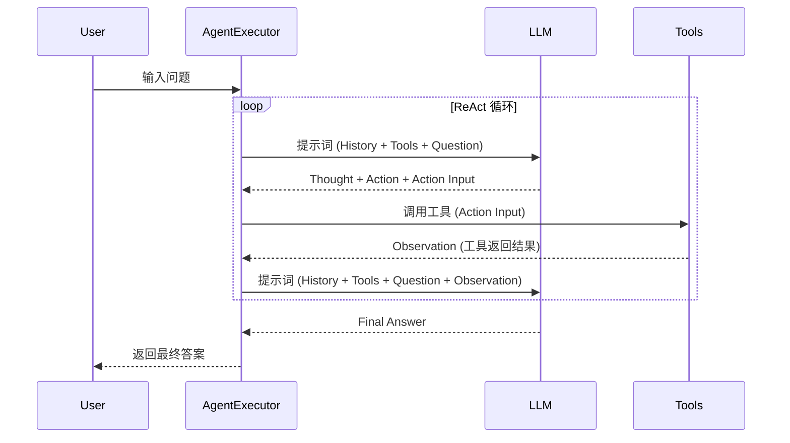

## Context

当前系统在 `agent/builder.py` 中使用 `langchain.agents.create_agent` 来构建 ReAct 智能体。这是一个旧版的 API。LangChain 推荐使用 `create_react_agent` 来构建标准的 ReAct 智能体。为了保持代码的现代性和更好的兼容性，我们需要进行迁移。

## Goals / Non-Goals

**Goals:**
- 将 `agent/builder.py` 中的构建器迁移到 `langchain.agents.create_react_agent`。
- 确保现有的 ReAct 推理逻辑（Thought/Action/Observation）在新版 API 下保持一致。
- 更新相关单元测试以反映 API 的变更。

**Non-Goals:**
- 更改 `AgentExecutor` 的逻辑（除非必要）。
- 更改现有的工具定义或提示词模板（除非新版 API 有特殊要求）。

## Decisions

### 1. 使用 `create_react_agent` 替代 `create_agent`
- **决策**: 在 `agent/builder.py` 中导入并调用 `create_react_agent`。
- **理由**: 这是 LangChain 官方推荐的构建 ReAct 智能体的方式。
- **参数变化**: `create_react_agent` 的参数通常包括 `llm`, `tools`, `prompt`。

### 2. 提示词模板适配
- **决策**: 检查 `prompt/react_prompt.py` 中的模板是否包含 `{tools}` 和 `{tool_names}` 占位符。
- **理由**: `create_react_agent` 内部会自动填充这些占位符。当前的 `REACT_PROMPT_TEMPLATE` 已经包含了这些占位符，因此不需要重大修改，但需要确保格式符合 `create_react_agent` 的期望。

### 3. 测试 Mock 调整
- **决策**: 更新 `tests/test_agent.py`，将对 `create_agent` 的 Mock 改为对 `create_react_agent` 的 Mock。
- **理由**: 测试应反映真实的调用逻辑。

## ReAct 循环序列图

## Risks / Trade-offs

- **[Risk] 提示词格式不兼容** → **Mitigation**: 如果 `create_react_agent` 对模板格式有更严格的要求，参考 LangChain 官方文档调整 `REACT_PROMPT_TEMPLATE`。
- **[Risk] 依赖版本问题** → **Mitigation**: 确保 `requirements.txt` 中的 `langchain` 版本至少为 0.1.0。
