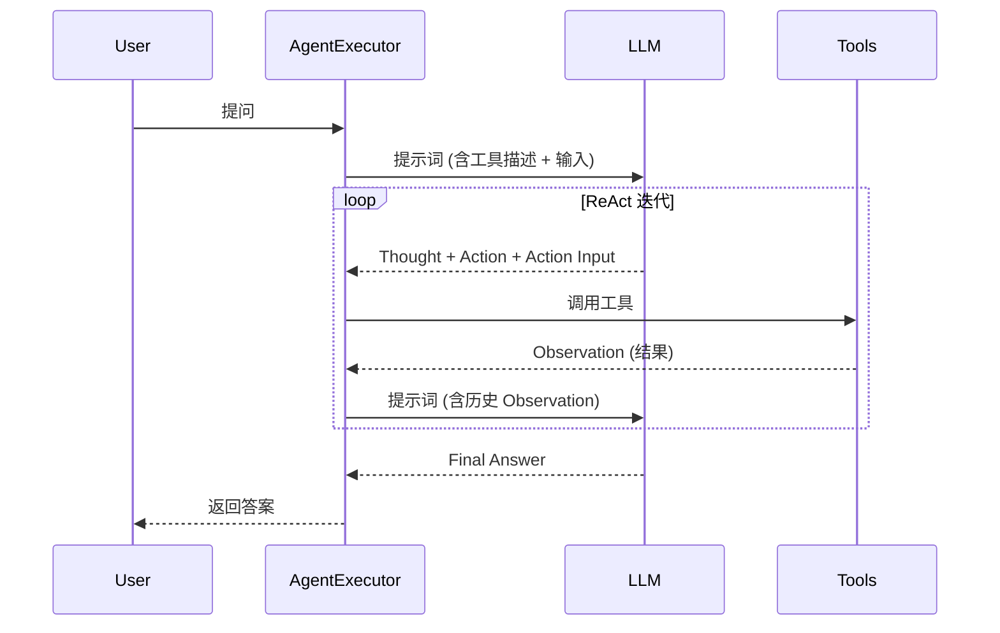

## Context

当前系统构建智能体的方式分散在 `agent/builder.py` 中，使用的是旧版的 `create_agent` 模式。随着 LangChain 0.1.0+ 的发布，官方推荐使用更模块化的方式，即先使用 `create_react_agent` 创建 Runnable 对象，再将其传递给 `AgentExecutor`。这种方式提供了更好的灵活性和标准化的参数处理。

## Goals / Non-Goals

**Goals:**
- 将智能体构建逻辑迁移到 `create_react_agent`。
- 升级依赖以支持最新的 API 功能。
- 确保 ReAct 循环（思考->行动->观察）在新 API 下依然稳定。
- 更新测试套件以反映 API 的变更。

**Non-Goals:**
- 重新设计工具的底层逻辑。
- 更改现有的 ReAct 提示词的核心内容（仅做格式适配）。

## Decisions

### 1. 核心构建器迁移
- **决策**: 在 `agent/builder.py` 中，使用 `langchain.agents.create_react_agent`。
- **理由**: 这是 LangChain v1 构建标准 ReAct 智能体的推荐 API，取代了旧的工厂函数。
- **替代方案**: 继续使用旧 API。缺点是未来版本可能会移除，且无法享受新版在解析错误处理上的改进。

### 2. 执行器配置优化
- **决策**: 在 `agent/executor.py` 中显式设置 `handle_parsing_errors=True`。
- **理由**: 新版 `AgentExecutor` 在处理 LLM 幻觉或非标准输出时更健壮。

### 3. 提示词占位符标准化
- **决策**: 确认并固定 `prompt/react_prompt.py` 中的四个核心占位符：`{input}`, `{tools}`, `{tool_names}`, `{agent_scratchpad}`。
- **理由**: `create_react_agent` 严格依赖这些占位符来注入工具描述和中间推理过程。

### 4. 依赖项锁定
- **决策**: 更新 `requirements.txt`，设置 `langchain>=0.1.0` 和 `langchain-openai>=0.1.0`。
- **理由**: 确保开发和生产环境使用的是支持新 API 的版本。

## ReAct 循环序列图

## Risks / Trade-offs

- **[Risk] 提示词格式解析失败** → **Mitigation**: 在集成测试中严格验证 LLM 是否能正确触发工具调用，必要时微调 `react_prompt.py`。
- **[Risk] 测试 Mock 失效** → **Mitigation**: 重构 `tests/test_agent.py`，模拟新的 `create_react_agent` 返回值。
