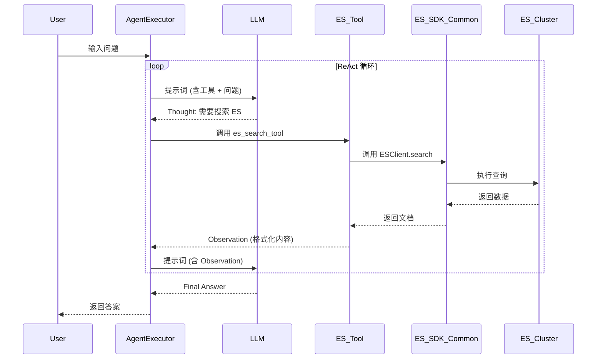

## Context

当前系统使用 ReAct 架构，智能体通过调用各种工具（如搜索、维基百科）来解决问题。为了扩展其对私有或结构化大规模数据的检索能力，引入 Elasticsearch 是一个关键步骤。目前系统没有与 Elasticsearch 交互的组件，所有数据都依赖外部公共 API。为了提高代码的可重用性，决定将 ES 核心逻辑作为 SDK 放在 `common/` 目录。

## Goals / Non-Goals

**Goals:**
- 提供一个健壮的 Elasticsearch SDK 封装，放置在 `common/es_client.py`，支持连接池和基本的 CRUD/查询操作。
- 实现一个供智能体直接使用的 `es_search_tool`，放置在 `tools/es_search_tool.py`。
- 支持通过外部配置文件加载 ES 连接信息。

**Non-Goals:**
- 实现 ES 集群的所有高级管理功能（如分片管理、索引重建等）。
- 更改智能体的核心推理引擎（ReAct 循环保持不变）。

## Decisions

### 1. 客户端库选择
- **决策**: 使用官方的 `elasticsearch` Python SDK。
- **理由**: 官方支持，文档齐全，且支持异步/同步调用。

### 2. 封装层设计与位置
- **决策**: 在 `common/es_client.py` 中实现 `ESClient` 类。
- **理由**: `common/` 目录用于存放跨模块通用的基础 SDK 或工具类，方便未来在非工具层（如数据预处理、管理后台）复用。
- **设计模式**: 使用单例模式管理 ES 客户端实例，确保连接重用。
- **功能**:
  - `search(index, query)`: 执行全文搜索。
  - `get_document(index, id)`: 获取特定文档。

### 3. 工具集成
- **决策**: 在 `tools/es_search_tool.py` 中定义智能体工具，并导入 `common.es_client`。
- **输入参数**: `query` (str) - 搜索关键字。
- **逻辑**: 工具内部调用 `ESClient.search`，并将结果格式化为字符串返回给智能体。

### 4. 配置管理
- **决策**: 在 `main.py` 的 `load_config` 逻辑中增加对 ES 配置项的读取。
- **变量**: `ES_HOST`, `ES_PORT`, `ES_USER`, `ES_PASSWORD`。

## ReAct 循环序列图 (集成 ES 工具)

## Risks / Trade-offs

- **[Risk] 连接超时/失败** → **Mitigation**: 在 `ESClient` 中实现重试机制和异常处理。
- **[Risk] 目录依赖复杂性** → **Mitigation**: 确保 `common/` 目录在 `PYTHONPATH` 中，或使用相对导入。
- **[Risk] 安全性** → **Mitigation**: 密钥信息必须从配置文件读取。
