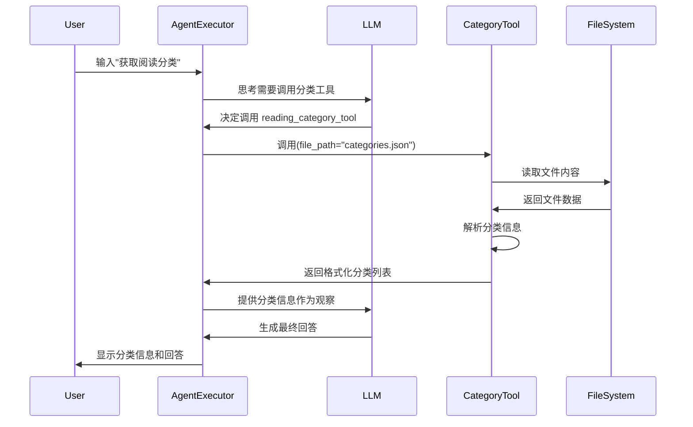

## Context

当前智能体系统已经具备基础的搜索和知识检索能力，但缺乏对结构化领域数据的处理功能。阅读领域分类信息通常存储在配置文件或数据文件中，智能体需要能够读取和解析这些信息来支持分类管理、内容推荐和知识组织等任务。

## Goals / Non-Goals

**Goals:**
- 提供统一的分类信息提取接口，支持多种文件格式
- 实现健壮的错误处理机制，处理文件不存在或格式错误的情况
- 返回结构化的分类信息，便于智能体进行后续处理
- 保持与现有工具架构的一致性，使用 `@tool` 装饰器

**Non-Goals:**
- 实现复杂的分类树形结构处理（如层级关系、继承等）
- 支持实时分类信息更新或写入操作
- 提供分类信息的可视化或编辑功能

## Decisions

### 1. 文件格式支持策略
- **决策**: 优先支持 JSON 和 YAML 格式，后续根据需要扩展其他格式
- **理由**: JSON 和 YAML 是存储结构化数据的常用格式，易于解析且支持嵌套结构
- **实现**: 使用 Python 标准库的 `json` 模块和第三方 `PyYAML` 库（如需 YAML 支持）

### 2. 工具接口设计
- **决策**: 使用单个文件路径参数，自动检测文件格式
- **理由**: 简化智能体调用，避免需要指定格式类型
- **接口**: `reading_category_tool(file_path: str) -> str`

### 3. 错误处理策略
- **决策**: 返回友好的错误信息而非抛出异常
- **理由**: 智能体需要能够处理工具执行失败的情况并继续推理
- **实现**: 使用 try-catch 包装文件操作，返回包含错误描述的字符串

### 4. 返回格式设计
- **决策**: 返回格式化的字符串而非复杂对象
- **理由**: LangChain 工具需要返回字符串结果供智能体处理
- **格式**: 使用换行分隔的分类列表，每个分类前加序号

### 5. 依赖管理
- **决策**: 按需引入依赖，YAML 支持作为可选功能
- **理由**: 最小化依赖增加，避免不必要的包引入
- **实现**: 尝试导入 `yaml` 模块，如果不可用则仅支持 JSON 格式

## Risks / Trade-offs

- **[风险] 文件格式检测可能不准确** →  mitigation: 提供明确的错误信息，支持手动指定格式参数（未来扩展）
- **[风险] 大文件处理性能问题** → mitigation: 添加文件大小检查，限制处理最大文件尺寸
- **[权衡] 功能完备性 vs 依赖简洁性** → 选择: 优先保持依赖简洁，按需扩展功能

## ReAct 循环序列图

